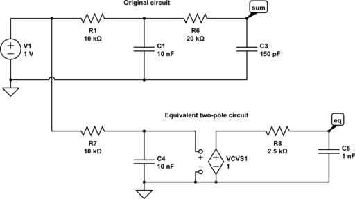

# Audio Processing (Filters!)

There are some facilities to help with the upsampling needed for the DACs. Some modules need a hex file containing the value of the coefficients to be copied into the MiST(er) folder for compilation. The hex files are available in hdl/sound folder.

## jtframe_fir

The module **jtframe_fir** is designed to operate on a stereo signal input to apply a FIR filter of up to 127 coefficients. It takes one BRAM block. As it needs about 256 clocks per sample, the input sampling frequency must be lower than clk/256.

## jtframe_dcrm

IIR filter to remove the DC value of a signal.

## jtframe_jt49_filters

This covers the usual situation of having two JT49 instances in a core. This module will add the two outputs, remove DC and filter out frequencies about 14kHz (for a JT49 clock of 1.5MHz). There is a qip file for this module.

# Audio Parameters in mem.yaml

Schematic information can be translated to parameters in mem.yaml to automatically compute low-pass filters and gain balance


```
rsum: 1k+1k+1.2k = 3.2k
rc: [ r: 1k, c: 33n ]
``

If the filter is of second order without an amplifier separating each filter pole, an equivalent 2-stage single-pole filter must be calculated. See the image below.


