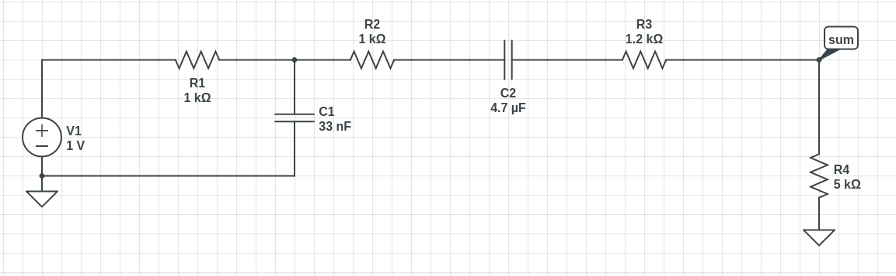
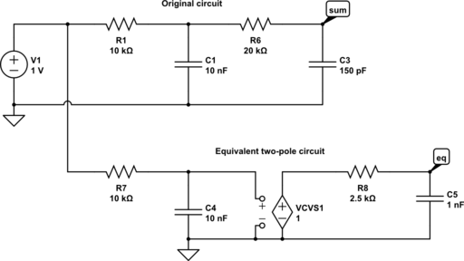

# Audio Processing (Filters!)

There are facilities to help with the upsampling needed for DACs. Some modules need a hex file containing coefficient values to be copied into the MiST(er) folder for compilation. The hex files are available in the `hdl/sound` folder.

## jtframe_fir

The module **jtframe_fir** is designed to operate on a stereo signal input to apply a FIR filter of up to 127 coefficients. It takes one BRAM block. As it needs about 256 clocks per sample, the input sampling frequency must be lower than clk/256.

## jtframe_dcrm

IIR filter to remove the DC value of a signal.

## jtframe_jt49_filters

This covers the usual situation of having two JT49 instances in a core. This module will add the two outputs, remove DC and filter out frequencies about 14kHz (for a JT49 clock of 1.5MHz). There is a qip file for this module.

# Audio Parameters in mem.yaml

Schematic information can be translated to parameters in `mem.yaml` to automatically compute low-pass filters and gain balance.



```
rsum: 1k+1k+1.2k = 3.2k
rc: [ r: 1k, c: 33n ]
```

If the filter is of second order without an amplifier separating each filter pole, an equivalent 2-stage single-pole filter must be calculated. See the image below.



## Switchable filters (`rc_en`)

`rc_en: true` makes a channel's pole switchable at runtime, modelling a 4066 that gates a cap in/out. It exposes a `<name>_rcen` game output and selects the pole by it: `rcen ? pole : 0` (0 = filter off). With `rc_en` the two-pole limit is lifted — list more poles and each pair becomes one switchable filter, with `<name>_rcen` widening to `[N-1:0]`.

```yaml
# rcen=1 adds the 0.15uF/1k pole; rcen=0 = bright
- { name: psga, rsum: 1k, rc_en: true, rc: [{ r: 1k, c: 150n }] }
```

Drive `<name>_rcen` from the relevant control bits (ddribble: YM2203 IOA[2:0] via the 4066 D5); tie to `0` until implemented. Used by `ddribble`, `mikie`, `comsc`, `circus`, `roc`.

### Complete example — ddribble SSG voices

Three SSG channels, each with a 0.15uF cap switched by one bit of the YM2203 port-A output:

```yaml
audio:
  channels:
    - { name: psga, rsum: 1k, rc_en: true, rc: [{ r: 1k, c: 150n }] }
    - { name: psgb, rsum: 1k, rc_en: true, rc: [{ r: 1k, c: 150n }] }
    - { name: psgc, rsum: 1k, rc_en: true, rc: [{ r: 1k, c: 150n }] }
```

The sound program enables/disables each cap by writing the YM2203 port A. Wire each `*_rcen` to its IOA bit — writing `1` switches the cap in (filter on), `0` switches it out (filter off):

```verilog
wire [7:0] ym_ioa_out;
jt03 u_ym2203( /* ... */ .IOA_out( ym_ioa_out ) /* ... */ );

assign { psga_rcen, psgb_rcen, psgc_rcen } = ym_ioa_out[2:0];
```
