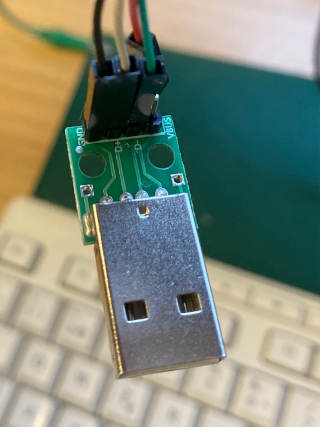

# Keyboard controls

JTFRAME maps the traditional MAME keyboard inputs to the game module. Apart from the player controls, the following keys are used:

Key           |   Action
--------------|-----------
  1-4         |  1P, 2P, 3P, 4P
  5-8         |  coin slots
  P           |  Pause, press SERVICE (9) while in pause to advance one frame
  9           |  Service
  T           |  Tilt
 F2           |  Test mode
 F3           |  Reset
 F4           |  Increase volume
 F5           |  Decrease volume

 ## Keys available in debug builds

 Key          | Action
--------------|-----------
 F7-F10       | gfx_en control see [debug.md](debug.md)
 shift+F7-F12 | sound channel mute
 +/-          | debug_bus control see [debug.md](debug.md)

 Most games ignore the *tilt* input. One that reacts to it is [Insector X](https://github.com/jotego/jtbubl), which shows the word *TILT* on screen and then reboots.

# Joysticks

JTFRAME supports four joysticks. Registers containing the coin and start button inputs are 4 bit long, but the game can just ignore the 2 MSB if it only supports two players.

The digital controllers (joysticks) are mapped as:

Bit  |  Action
-----|--------
 0   | right
 1   | left
 2   | down
 3   | up
 4+  | buttons

If a different mapping is needed, it should be set via a JTFRAME_JOY macro. The analog stick is used to emulate a 32-way joystick via pulse-width modulation.

Analog controllers are connected via ports:

```
input   [15:0] joyana_l1, joyana_l2, joyana_l3, joyana_l4,
input   [15:0] joyana_r1, joyana_r2, joyana_r3, joyana_r4,
```

Analogue sticks uses 2-complement bytes to signal information: right and bottom are possitive (127 is the maximum). Left and top are negative (FFh minimum, 80h maximum)

| Stick  | joyana_l1[7:0] |
|:-------|:---------------|
| center | 00             |
| right  | 01 -> 7F       |
| left   | FF -> 80       |

| Stick  | joyana_l1[15:8] |
|:-------|:----------------|
| center | 00              |
| down   | 01 -> 7F        |
| up     | FF -> 80        |

Support for 4-way joysticks (instead of 8-way joysticks) is enabled by setting high bit 1 of core_mod. See MOD BYTE.

## Analogue Pocket

The Pocket signals are translated to the JTFRAME standard. Their original encoding is:

For the *contx_key* signals:

 Bit | Meaning
-----|---------
 0   |  dpad_up
 1   |  dpad_down
 2   |  dpad_left
 3   |  dpad_right
 4   |  face_a
 5   |  face_b
 6   |  face_x
 7   |  face_y
 8   |  trig_l1
 9   |  trig_r1
 10  |  trig_l2
 11  |  trig_r2
 12  |  trig_l3
 13  |  trig_r3
 14  |  face_select
 15  |  face_start

All analogue stick and trigger signals are unsigned.

For the *contx_joy* signals:

Bits | Meaning
-----|-----------
 7: 0| lstick_x
15: 8| lstick_y
23:16| rstick_x
31:24| rstick_y

For the *contx_l/rtrig* signals:

 Bits | Meaning
------|----------
 7: 0 | ltrig
15: 8 | rtrig

Original documentation [here](https://www.analogue.co/developer/docs/bus-communication#pad).

## DB15 Support

The DB15 hardware from Antonio Villena can be enabled in the OSD. It will replace USB input to the game for players 1P and 2P. Controlling the OSD with the DB15 input is possible and uses the command byte *0xF*. If future MiSTer versions used that value, the file *hps_io.v* will need to be edited to support it. Declaring the macro **JTFRAME_NO_DB15_OSD** will disable OSD control.

The macro **JTFRAME_NO_DB15** disables DB15 support.

# Trackball

The popular upd4701 is modelled in [jt4701](../hdl/keyboard/jt4701.v). The main module **jt4701** represents the original chip and should work correctly when connected to a trackball. There are two helper modules: jt4701_dialemu and jt4701_dialemu_2axis.

The trackball only measures differences in position from a reset event. Games often reset the count and because of that, the trackball cannot be easily replaced by an absolute value.

## jt4701_dialemu

Use to emulate trackball inputs with buttons. One button is used to increase the axis, and the other to decrease it. A rather slow clock is used at the *pulse* input to set the update rate. This emulator is meant to be hooked to the **jt4701** when no real trackball is present.

## jt4701_dialemu_2axis

A more comprehensive trackball emulator that already instantiates internally the **jt4701** and can be easily interface with the CPU.

# Paddle
**Paddle support is preliminary**

A [paddle](https://en.wikipedia.org/wiki/Paddle_%28game_controller%29) has a range of values and can hold a position. For some games, it is convenient to use the analog sticks found in modern gamepads. For other, the mouse may be a better interface. JTFRAME provides four 8-bit paddle signals, that can be mapped to other controllers.

Paddle # | Mouse axis | Joystick   | Analog stick
---------|------------|------------|-------------------
  0      |   X        | 1P, L/R    | 1P left stick L/R
  1      |   Y        | 1P, U/D    | 1P left stick U/D
  2      |            | 2P, L/R    | 2P left stick L/R
  3      |            | 2P, U/D    | 2P left stick U/D

The macro **JTFRAME_PADDLE** enables the paddle inputs to the game module. The macro **JTFRAME_PADDLE_MAX=max** sets the maximum value the paddle can handle, otherwise the maximum is 8'hff and the minimum is 8'h0. The paddle value is unsigned.

Paddle emulation is provided for MiST. For MiSTer, the regular paddle signals sent by the MiSTer firmware are used.

# Mouse

Mouse control is simplified for arcades. Enable it with **JTFRAME_MOUSE**. The mouse buttons get mapped over the joystick buttons, so both can be used together. The mouse resolution is 8 bits per axis and up to two mouse devices can be connected. Two inputs are added to the game module with **JTFRAME_MOUSE**: *mouse_1p* and *mouse_2p*. Each is a 16-bit bus, where the upper 8 bits account for vertical movement and the lower for horizontal. Notice that the mouse signals are signed. Some games may require a sign + magnitude value. Set **JTFRAME_MOUSE_NO2COMPL** to get that format.

By default, the mouse input can be emulated by using the regular joystick and keyboard controllers. This means that the mouse signals will respond to both an actual mouse connected to the FPGA but also to joystick and keyboard inputs. If that creates a problem in the core, the mouse emulation can be disabled by setting **JTFRAME_MOUSE_NOEMU**.

The game *Block* of the [JTPANG](https://www.github.com/jotego/jtpang) can serve as an example.

# Spinner

Support is enabled with the **JTFRAME_DIAL** macro. This will add dial sensitivity options to the OSD menu. The core is expected to use the [jt4701](../hdl/keyboard/jt4701.v) to convert the dial signals to a number. Many arcade games expect an interface like the one provided by the **jt4701**, which needs dial signals to operate with and not an absolute spinner value.

Keeping the game module compatible with dial signals make it easier to hook directly to a bare spinner in the future. The **jt4701** does not clamp the values, so it cannot be connected to a paddle signal because after some turns, the paddle will get stuck at its limits. **jt4701** requires the dial signals. **jtframe_board** translates joystick and and spinner signals to dial pulses.

The dial is automatically emulated with the 1P joystick using buttons 1 and 2 as left and right. If other buttons are preferred, such as left/right directions, then **JTFRAME_DIALEMU_LEFT** must be set to the bit in the *joystick* signal to be used as left. The next one will be right.

The mouse is automatically detected and used as dial emulator.

The only spinner tested so far is the one from Ultimate MiSTer (not affiliated to JOTEGO). For this, MiSTer always seems to send a delta of just 1 or 2. **jtdial** ignores MiSTer's delta and set its own one based on the OSD settings.

# UART

JTFRAME comes with a simple [UART interface](../hdl/jtframe_uart.v) that can serve to connect to an external computer.

The UART is connected to the MIDI pins in MiST and to pins 1 (Tx) and 2 (Rx) of MiSTer USB3-connection port. By default, cores are compiled without an UART.

The first use is to enable the cheat engine. That will connect an UART to the PicoBlaze CPU. In MiSTer, an OSD option will appear to enable access to the pins. As the user may have connected something else to the USB3 connector, it is important to start with that connection off. The UART access will not use the open drain connectivity for the user port, so it may break a device connected to it.

## Pinout

The USB2 pins are used:

Pin   | user_io  |  Use
------|----------|------------
D+    |    0     | JTFRAME Tx
D-    |    1     | JTFRAME Rx

This is how it looks with a common USB UART connected:



Linux serial port configuration:

```
stty -F /dev/ttyUSB1 57600 raw
```

For cores compiled at 96MHz (such as JTCPS) the speed is doubled: 115200