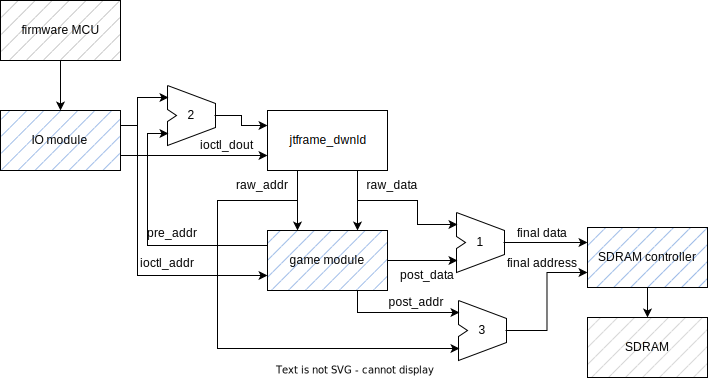
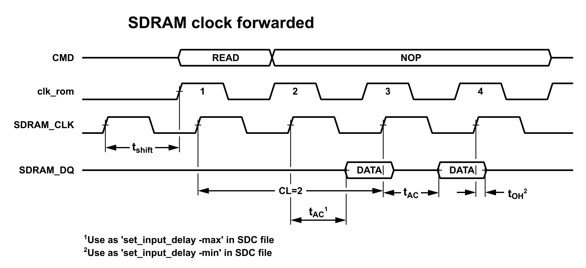
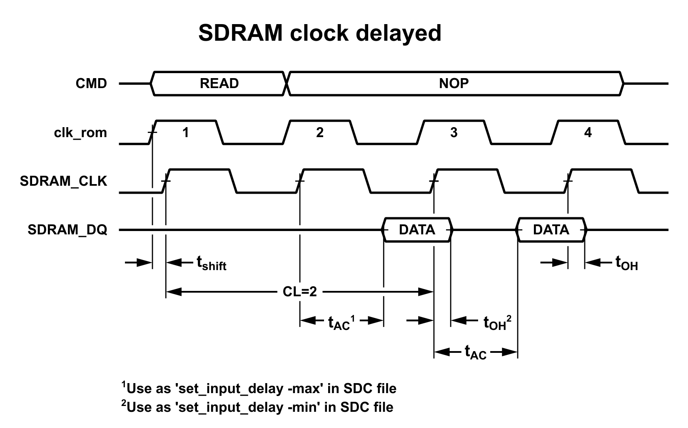

# IOCTL Indexes

For I/O (SDRAM download, etc.) the following indexes are used

| Purpose              | MiST | MiSTer | Pocket          | Sim File  |
|:---------------------|:-----|:-------|:----------------|:----------|
| Main ROM             | 0    | 0      | 1               | rom.bin   |
| JTFRAME options      | 1    | 1      | F900'0000 write | core.mod  |
| Cartridges           |      | 4      | 4               | cart.bin  |
| NVRAM                | 255  | 2      | 2               | nvram.bin |
| Cheat ROM            | 16   | 16     | 16              |           |
| Beta keys            | N/A  | 17     | 17              |           |
| CRT-VGA/SNAC Config  | N/A  | N/A    | 18              |           |
| DIP switches         | N/A  | 254    | N/A             |           |
| Cheat switches       | N/A  | 255    | N/A             |           |

The cheat ROM and the beta key files must be stored in the folder `/Assets/jtpatreon/common`

In order to use cartridges:

- Define **JTFRAME_CART_OFFSET** in *macros.def*
- Define **carts** in the **[ROM]** section of *mame2mra.toml*

In MiSTer, the IOCTL ID for cartridges is limited to 6 bits. That enforces a 6-bit limit at JTFRAME for all indexes. But, MiSTer reserves some indexes for which 8 bits are used. See the table above.

## core_mod (JTFRAME options)

Bit    |  Use                      | Set by
-------|---------------------------|---------
0      | High for vertical games   | mame.xml
1      | 4-way joysticks           | JTFRAME_SUPPORT_4WAY
2      | XOR with dip_flip         | mame.xml
3      | dial input enable         | mame.xml
4      | reverse the dial          | mame.xml
5      | Horizontal frame bit 0    | mame.xml
6      | H. frame bit 1            | mame.xml
15-8   | sound volume              | mame2mra.toml's audio section

If JTFRAME_VERTICAL is defined, bit 0 is set during power up. The contents of core_mod can be set by defining a index=1 rom in the MRA file.

H Frame | Meaning
--------|---------
00      |  No frame
01      |  8-pixel frame
10      | 16-pixel frame
11      |  rserverd

The volume is defined in the TOML file **Audio** section like this:

``` TOML
[Audio]
volume = [
    { machine="secretag", value=0x70 },
    { machine="bouldash", value=0x34 },
]
```

A value of 0x80 means unity gain. Valid values range from 0x10 to 0xFF. If there is no **Audio** section, the framework will set the game to unity gain. Volume setting is not supported in the MiST family because of limitations in the *core_mod* assignment to just 7 bits.

## Cartridges

If a system has a BIOS (firmware) plus cartridge ROMs, like NeoGeo Pocket, then there will be two different ROM transfers. The first one has the BIOS and is considered the *main ROM*. The second one contains the cartridge dump, i.e. the real game. The cartridge uses a different download index.

The core logic does not have access to the download index as that is *target* specific. Instead, the core should define the **JTFRAME_CART_OFFSET** as the download address start for cartridge data. JTFRAME will add that offset to **ioctl_addr** when sending data to the core.

**JTFRAME_CART_OFFSET** can be matched with **JTFRAME_BA1_START** so data is automatically sent to bank 1, for instance.

Declaring **JTFRAME_CART_OFFSET** will also enable the load option for the cartridge index in the MiSTer OSD menu. See [MiSTer's config string](../target/mister/cfgstr) and [MiSTer's documentation](https://github.com/MiSTer-devel/Wiki_MiSTer/wiki/Core-configuration-string).

There are two files linking what to be loaded during simulation:

- rom.bin is either the ROM data from MRA files or the firmware
- cart.bin is the cartridge data for systems using firmware and cartridges

If there is firmware, this is transferred first in simulation.

## Saving Data to the SD Card

It is possible to save information on the SD card. You have to follow these steps:

1. Define the macro **JTFRAME_IOCTL_RD** with the size of the dump
2. Define the **ioctl_ram** input signal and the 8-bit **ioctl_din** output bus as ports in the game module
3. If you use *mame2mra.toml*, simply regenerate the files with `jtframe mra <corename>`. If not, manually add a `<nvram index="2" size="your data size"/>` element to the MRA.

When **ioctl_ram** is high, JTFRAME expects **ioctl_din** to have the contents matching the address at **ioctl_addr**. There is no read strobe and read speed is controlled by the platform firmware, so it may be too fast for direct dumping off the SDRAM. Note that **ioctl_ram** is also high when the firmware is sending the NVRAM data to the core during the downloading phase. You can distinguish between the two scenarios by checking the **downloading** signal.

If **ioctl_ram** comes from SDRAM, then care must be taken to toggle the sdram slot **cs** signal, as the *ram request* modules require **cs** to toggle to read new data.

The write operation is triggered from the OSD *save settings* (MiSTer) or *Save NVRAM* (MiST) option. PocketFPGA support is not ready yet.

### Automatic SDRAM Dump

A fraction of bank zero's SDRAM contents can be dumped to the micro SD card on **MiSTer** using the NVRAM interface. The underlying implementation consists of using BRAM to make a *shadow* copy of the SDRAM contents. Because BRAM is scarce in most FPGA devices, this approach is only valid for MiSTer.

You have to define two macros in macros.def:

```
JTFRAME_SHADOW=0x10_0000
JTFRAME_SHADOW_LEN=10
```

The first one defines the start address, and the second the number of address bits to dump. The example above will dump 1k-word, i.e. 2kByte.

The MRA file must include `<nvram index="2" size="2048"/>`. MiSTer will create a dump file each time the `save settings` option is selected in the OSD.

At the time of writting, MiSTer firmware doesn't handle correctly NVRAM sizes equal or above 64kB.

# Memory RTL Generator

JTFRAME expects the core game module to have the SDRAM interface ports for downloading the game data and accessing the SDRAM during the core operation. The interface supports full access to the four SDRAM banks. JTFRAME also provides the developer with a series of modules to interface with the SDRAM as easily as possible.

However, making these connections is error prone and also ties the core to a SDRAM memory implementation. Taking the SDRAM out of the game module will make it implementation independent. A game module that just demands data and waits for it can then be connected to a SDRAM, BRAM, DDR or other technology. The problem with this approach is how to make a meaningful data interface for the core.

Another problem with instantiating all the memory modules is simply the verbosity required to do it. Declaring signals, instantiating the right cells, etc. is easy yet error prone.

In order to tackle these two problems, it is possible to create a YAML file called *mem.yaml* in the core's *hdl* folder. JTFRAME will compile a memory interface based on this file. The game module interface must match the one defined in the *mem.yaml*. This is an example from the [kicker](https://github.com/jotego/jtkicker) core:

```
sdram:
  preaddr: true
  noswab: true
  banks:
    -
      buses:
        -
          name: scr
          # 32-bit buses are indexed like
          # scr_addr[13:1], the LSB (index 0)
          # is always zero
          addr_width: 14
          data_width: 32
          offset: "`SCR_START >> 1"
        -
          name: objrom
          addr_width: 15
          data_width: 32
          offset: "`OBJ_START >> 1"
          # rw: true/false
        -
          name: pcm
          addr_width: 16
          data_width: 8
          offset: "`PCM_START >> 1"
        -
          name: main
          addr_width: 16
          data_width: 8
```

In this example only one bank is used. You can check the *game_sdram.v* file that is generated to see what JTFRAME does. Another core that uses *mem.yaml* is [Extermination](https://github.com/jotego/jtbubl). Eventually, all cores should take this approach. Explicit SDRAM modules are deprecated for new cores.

*mem.yaml* can also instantiate BRAM modules, making it easy to swap a given memory location from SDRAM to BRAM. BRAM modules are also easily configurable for saving back to the SD card via the IOCTL interface. For example:

```
bram:
  - name: eerom
    addr_width: 11
    data_width: 8
    din: mcu_dout
    rw: true
    ioctl: { save: true, order: 0 }
```

This will generate the right code for the BRAM instantiation with dumping through IOCTL and an auxiliarry *dump2bin.sh* in the *ver/game* folder to help convert the file(s) to simulation format. The macro **JTFRAME_SIM_IODUMP** works in Verilator to simulate the IOCTL process and generate a dump file within the simulator.

Look at the cores using *mem.yaml* and at the Go source code to understand how the *mem.yaml* works. Also, look at the tool help with `jtframe mem -h`

When a *mem.yaml* file exists, *jtframe* automatically declares the **JTFRAME_MEMGEN** macro.

## Ports in the Game Module

The memory ports can be taken into the design by including the file `mem_ports.inc`, which will be created if the include state is found. The ports can be automatically added to the core game module by adding this at the bottom of the port list:

```
    /* jtframe mem_ports */
);

or

    `include "mem_ports.inc"
);
```

Note that no ports should be added manually after the `jtframe mem_ports` line.

Following the standard [naming convention](style.md) for memories, 8-bit memory ports start at memory address 0, 16-bit ports at 1 and 32-bit ports at 2.

## Address Mapping and Data Transformation during Downloading

The lines in and out of the automatic jtframe_dwnld instance can be send through the game module in order to change the address mapping or modify the data bits. An example of this situation is _jtmikie_ in the [jtkicker](https://github.com/jotego/jtkicker) repository.

The following diagram shows how three _virtual_ multiplexers can be individually enabled in the *mem.yaml* file in order to manipulate the SDRAM programming signals.




# SDRAM Timing

SDRAM clock can be shifted with respect to the internal clock (clk_rom in the diagram).





For small shifts, the synthesizer will be able to align the SDRAM data and clock with the internal core clok (clk_rom). But if the shift is large enough, the SDRAM may be operating at a different state and the SDRAM controller has to adjust the state count to reflect that. This is achieved by defining the macro **JTFRAME_SHIFT**. Ideally, the shift needed should be close to zero. But, some platforms synthesize better using SDRAM shifts. This cannot be changed per-core, but per-target. If the target platform shifts the clock, it will define the macro in its _target.def_ file and set the gamepll settings accordingly.

# SDRAM Controller

There are three different SDRAM controllers in JTFRAME. They all work and are stable, however only the latest one is connected to jtframe_board. The others are left for reference.

## JTFRAME_SDRAM

**jtframe_sdram** is a generic SDRAM controller that runs upto 48MHz because it is designed for CL=2. It mainly serves for reading ROMs from the SDRAM but it has some support for writting (apart from the initial ROM download process).

This module may result in timing errors in MiSTer because sometimes the compiler does not assign the input flip flops from SDRAM_DQ at the pads. In order to avoid this, you can define the macro **JTFRAME_SDRAM_REPACK**. This will add one extra stage of data latching, which seems to allow the fitter to use the pad flip flops. This does delay data availability by one clock cycle. Some cores in MiSTer do synthesize with pad FF without the need of this option. Use it if you find setup timing violation about the SDRAM_DQ pins.

SDRAM is treated in top level modules as a read-only memory (except for the download process). If the game core needs to write to the SDRAM the **JTFRAME_WRITEBACK** macro must be defined.

[1:0] prog_bank     bank used during SDRAM programming
[1:0] sdram_bank    bank used during regular SDRAM use

These signals should be used in combination with the rest of prog_ and sdram_ signals in order to control the SDRAM.

The data bus is held down all the time and only released when the SDRAM is expected to use it. This behaviour can be reverted using **JTFRAME_NOHOLDBUS**. When this macro is defined, the bus will only be held while writting data and released the rest of the time. For 48MHz operation, holding the bus works better. For 96MHz it doesn't seem to matter.

In simulation data from the SDRAM can be double checked in the jtframe_rom/ram_xslots modules if **JTFRAME_SDRAM_CHECK** is defined. The simulation will stop if the read data does not meet the expected values.

## JTFRAME_SDRAM_BANK

**jtframe_sdram_bank**  is a high-performance SDRAM controller that achieves high data throughput by using bank interleaving.

HF parameter should be set high if the clock frequency is above 64MHz

Performance results (MiST)

Frequency  |  Efficiency  |  Data throughput  | Latency (min)  | Latency (ave) | Latency (max)
-----------|--------------|-------------------|----------------|---------------|---------------
<64MHz     |  100%        | f*2     =128MB/s  |    7 (109ns)   |    9 (140ns)  |    29 (453ns)
96MHz      |  66.7%       | f*2*.667=128MB/s  |    9 ( 73ns)   |   11 (114ns)  |    30 (312ns)

Performance results (MiSTer - A lines shorted to DQM)

Frequency  |  Efficiency  |  Data throughput  | Latency (min)  | Latency (ave) | Latency (max)
-----------|--------------|-------------------|----------------|---------------|---------------
<64MHz     |   72%        | f*2*.72 = 92MB/s  |    7 (109ns)   |    9 (140ns)  |    32 (500ns)
96MHz      |   53.3%      | f*2*.533=102MB/s  |    9 ( 73ns)   |   12 (125ns)  |    36 (375ns)

Note that latency results are simulated with refresh and write cycles enabled.

## SDRAM Catalogue

ID  | Part No          | Units | Size
----|------------------|-------|-----
  1 | AS4C32M16SB-6TIN |    2  | 128
  2 | W9825G6KH-6      |    1  |  32
  3 | AS4C16M16SA-6TCN |    1  |  32
  4 | AS4C32M16SB-7TCN |    2  | 128
  5 | W9825G6KH-6      |    1  |  32
  6 | AS4C32M8SA -7TCN |    2  |  64
  7 | AS4C32M8SA -7TCN |    4  | 128
8,9 | AS4C32M16SB-6TIN |    2  | 128

All time values in ns, capacitance in pF

Part No           | Op. Current (mA) | Ci     | Ci/o | tRRD  | tRP    | tAC CL=2 | tOH | tHZ
------------------|------------------|--------|------|-------|--------|----------|-----|-----
AS4C16M16SA -6/-7 |  60/55 (1 bank)  | 2-4    |  4-6 | 12/14 | 18/21  | 6/6      | 2.5 | 5/5.4
AS4C32M16SA -6/-7 | 120/110(1 bank)  |3.5-5.5 |  4-6 | 12/14 | 18/21  | 6/6      | 2.5 | 5/5.4
AS4C32M8SA  -6/-7 |  60/55 (1 bank)  | 2-4    |  4-6 | 12/14 | 18/21  | 6/6      | 2.5 | 5/5.4
W9825G6KH-6       |   60             | <3.8   | <6.5 |  15   |  15    | 6        |  3  | 6

## Maximum Current (MiST)

MiST uses a single SDRAM module, with about 4pF per pin. In order to charge it up to 3.3V in 4ns we need 3.3mA. Current per pin is limited to 4mA in order to prevent noise.

## SDRAM Header (MiSTer)

Pin view with SDRAM on top, ethernet cable on the bottom right

DQ1 DQ3 DQ5 DQ7 DQ14 NC  DQ13 DQ11 DQ9 DQ12  A9 A7 A5 WE VDD CAS CS1 BA1 BA0 A2
DQ0 DQ2 DQ4 DQ6 DQ15 GND DQ12 DQ10 DQ3 CLK  A11 A8 A6 A4 GND RAS BA0 A10 A1  A3

## SDRAM Electrical Problems (MiSTer)

On MiSTer SDRAM modules as of December 2020 have a severe VDD ripple. VDD can go above 4V and reach 2.4V. 32MB modules are slightly better.

MiSTer SDRAM modules also suffer of intersymbol interference. Although it is not clear which lines couple more closely -no layout parasitics for any board are available- setting the DQ bus from the FPGA for a write at the time of RAS showed worse results than setting it at CAS time for Contra core using the sdram_bank controller (based on 7e93cc5 commit).

Measurements of A3 line and VDD (SDRAM module #4 with 10uF electrolytic added):

Slew Rate  |  Max V(A3)  | Min V(A3)  | tr/tf (ns)
-----------|-------------|------------|-----------
Fast (2)   | 3.92        | -0.92      |  3
Slow (0)   | 3.76        | -0.60      |  4

VDD ripple also improves with slower slew rates (module #8):

Slew Rate  | Max VDD  | Min VDD
-----------|----------|---------
Fast (2)   |   4.12   |  2.58
Slow (0)   |   3.98   |  2.74


Using the slowest slew rate fixes Contra load on all tested modules, regardless of when DQ is set at write time:

Module | DQ at RAS   |  DQ at CAS
-------|-------------|-------------
       | fast | slow | fast | slow
-------|------|------|------|------
1      |  NG  | OK   | OK   |  OK
2      |  NG  | OK   | NG   |  OK
3      |  OK  | OK   | NG   |  OK
4      |  NG  | OK   | OK   |  OK
7      |  NG  | OK   | NG   |  OK
8      |  NG  | OK   | OK   |  OK
9      |  NG  | OK   | OK   |  OK
-------|------|------|------|------
Fails  |   6  |  0   |  3   |   0

Faster slew rates mean more current going through the connector, thus more ripple at both the signal pin and VDD. So both problems become better. This doesn't mean they are completely solved. VDD ripple is still out of spec with the current capacitor set used. And slowing down further the bus should also help.

## SDRAM Clock Shift

I made a clock shift sweep using JTCONTRA commit 5633ee41. These are the results of valid values:

Module | Min  |  Max  | Remarks
-------|------|-------|---------
1      | 3.5  | 8.25  |
2      | 2.5  | 8.5   | 32MB
3      | 2.5  | 8.75  | 32MB
4      | 3.0  | 8.0   | 10uF added
7      | 4.0  | 8.25  | min improved to 3.5ns by adding 33uF
8      | 3.5  | 8.0   |
9      | 3.25 | 8.25  |
AV sys | 3.0  | 8.25  | Same results with fan on/off

The wider the difference is between max and min, the cleaner signals are.

Most cores in the official MiSTer repository seem to use a strategy of a full 180º clock shift. This has the advantage of providing an accurate value of the clock at the pin as it can be generated using an IO primitive. However, it means that the last word of the burst is read with the bus at high impedance, so it has a higher potential for failures. It helps when timing cannot be met as it simplifies internal routing. Enable it with **JTFRAME_180SHIFT**

## CRT-VGA Configuration (Pocket)

For setting the configuration of an Analog video output in Analogue Pocket, a bus ([11:0] crt_cfg) has been set to carry the following information:


Bit | Use                                        |
----|--------------------------------------------|
11  | Enable Analogic Video Output               |
10  | Bypass Video Mist Module and direct assign |
 9  | Set YPbPr outout                           |
 8  | Set Composite Video (default to NTSC)      |
 7  | Enable PAL Composite Video                 |
 6  | Unused                                     |
 5  | Enable Composite Sync                      |
 4  | Enable Bandwidth effect                    |
 3  | Enable Sync-on-Green (SOG)                 |
1,2 | Scanlines mode selection                   |
 0  | Scandoubler Enabler                        |


 ## SNAC Controllers Configuration (Pocket)

For setting the configuration of a SNAC Controller in Analogue Pocket, a bus ([4:0] snac_config) has been set to carry the following information:


Bit | Use                              |
----|----------------------------------|
4-0 | SNAC type of controller/adapter  |


 BUS VALUE |  SNAC Adapter    |  FUNCTION                |
-----------|------------------|--------------------------|
   0x0     |  None            |  disables SNAC interface |
   0x1     |  DB15 Normal     |  1/2 players             |
   0x2     |  NES             |  1/2 players             |
   0x3     |  SNES            |  1/2 players             |
   0x4     |  PCE 2BTN/6BTN   |  1 player                |
   0x6     |  PCE Multitap    |  allows 4 players        |
