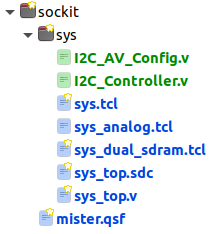

# JTFRAME target for [SoCkit (MiSTer) Platform](https://github.com/sockitfpga/MiSTer_SoCkit) 

Sockit target by @somhi

### Target information

SoCkit board has many similarities with the DE10-nano board (includes the same FPGA) and therefore it is compatible with the MiSTer platform. The same applies to the DE10-Standard and DE1-SoC boards all from Terasic.

The SoCkit target leverages all built-in hardware capabilities of the board:

- VGA 24 bit analog video output
- Audio CODEC with line-in, line-out, and mic input

Main difference with the DE10-nano is that it does not include an HDMI video output and that it is required to buy an additional HSMC-GPIO adapter to attach an external SDRAM [compatible MiSTer module](http://modernhackers.com/128mb-sdram-board-on-de10-standard-de1-soc-and-arrow-sockit-fpga-sdram-riser/). 

More information about how to use the SoCkit board as a MiSTer compatible platform can be found at https://github.com/sockitfpga/MiSTer_SoCkit.

### Resources

* [GitHub organization](https://github.com/sockitfpga)  
* [SoCkit MiSTer compatible platform](https://github.com/sockitfpga/MiSTer_SoCkit)

* [Telegram group](https://t.me/Sockit_FPGA)
* [Discord channel](https://discord.gg/YDdmtwh)

### Useful Links

MiSTer has a linux subsystem running on an ARM9 called the _Hard Processor System_ (the HPS). Communication with it is done using the Intel's Avalon interface.

- [Cyclone V Hard Processor System Technical Reference](https://www.intel.com/content/www/us/en/docs/programmable/683126/21-2/hard-processor-system-technical-reference.html)
- [Avalon Interface Specifications](https://www.intel.com/content/www/us/en/docs/programmable/683091/20-1/introduction-to-the-interface-specifications.html)

### Others

* Read carefully the [compilation instructions](../../doc/compilation.md).  
* Main changed files from MiSTer target are:

